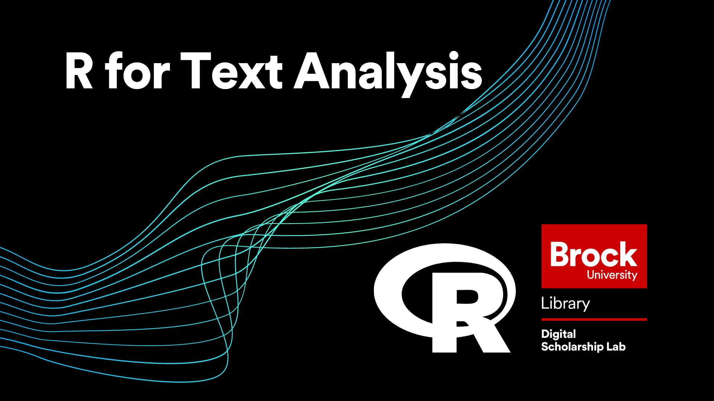

# Text Analysis with R
In this workshop you will learn about the basics of doing text analysis with the R programming language.  This includes:
- Tokenizing a corpus of text
- Learning about stopwords and how to deal with them
- Learning the basics of doing word frequency analysis

## Setup Instructions
In preparation for this workshop, you will need to have an R Studio Cloud account and have a new project open.  Follow the steps below to get set up.

- (Skip this step if you already have an R Studio Cloud account) Begin by going to [https://rstudio.cloud/](https://rstudio.cloud/) and signing up for an account by clicking on the "Sign Up" text at the top right of the screen, then click the grey "Sign Up" button and fill in the form (or use the convenient Google or GitHub options if you have one of those accounts)
- Log in to R Studio Cloud
- You should arrive at your workspace.  From here click on the button that says, "New Project" and select "New R Studio Project"
- Once your project has finished building, open the "Source" window by clicking on the double box symbol in the top right corner of the "Console" window


 - Rename your project by clicking on the name at the top.  Name it whatever you like (eg. "R for Text Analysis Workshop")


 - Lastly, install and activate both the "tidyverse" and "tokenizers" packages.  This may take a couple of minutes.  Make sure to wait until one is completed before running the next.


 - And thats it!  You are all set for the workshop

----
## Workshop Tasks

**Task Set #1**  

1. Create a variable called "text" using the following code:  

```R
text <- paste("You will rejoice to hear that no disaster has accompanied the commencement of an enterprise which you have regarded with such evil forebodings. I arrived here yesterday, and my first task is to assure my dear sister of my welfare and increasing confidence in the success of my undertaking")  
```

2. Create a variable containing the above text tokenized into words  (Remember that the tokenizer makes a list of lists)  
3. Find out how long your new list of words is using the length function  
4. Turn your list of words into a data frame (remember to make it into a table first)  
5. Arrange your data frame so the most common words are listed first  
6. When you are done type "GOT IT!!" into the chat  

  
**Task Set #2**  

1. Tokenize the paragraph in the "text" variable into sentences and pull out just the list  
2. Tokenize your sentences into lists of words  
3. Use the "sapply" function to find the length of each list of words  
4. When you are done type "TOKENIZED!!" into the chat  

  
**Task Set #3**  

1. Use the code below to load in the full text of the book "Frankenstein"  

```R
text <- paste(readLines("https://raw.githubusercontent.com/BrockDSL/R_for_Text_Analysis/master/frankenstein.txt"),collapse = "\n")  
```

2. Using your code from before, tokenize the book into words and then turn it into a dataframe arranged by count  
3. Use the code below to load in the word frequency dataset  

```R
wordfreq <- read_csv("https://raw.githubusercontent.com/BrockDSL/R_for_Text_Analysis/master/wordfrequency.csv")  
```

4. Join the two datasets together to get frequency values for each word in the book  
5. Filter your results to remove the stopwords. (Try out different frequency values to see more or less common words)  
6. Type "STOPWORDS ELIMINATED" into the chat when you are done  


----
## Follow Up Material
If you are looking to continue enhancing your knowledge of R, check out our other R workshops or try out one of the options below!

[YaRrr! The Pirate's Guide to R](https://bookdown.org/ndphillips/YaRrr/)   
  
[W3Schools R Tutorial](https://www.w3schools.com/r/default.asp)
  
 

  
**This workshop is brought to you by the Brock University Digital Scholarship Lab.  For a listing of our upcoming workshops go to [Experience BU](https://experiencebu.brocku.ca/organization/dsl) if you are a Brock affiliate or [Eventbrite page](https://www.eventbrite.ca/o/brock-university-digital-scholarship-lab-21661627350) for external attendees.**

